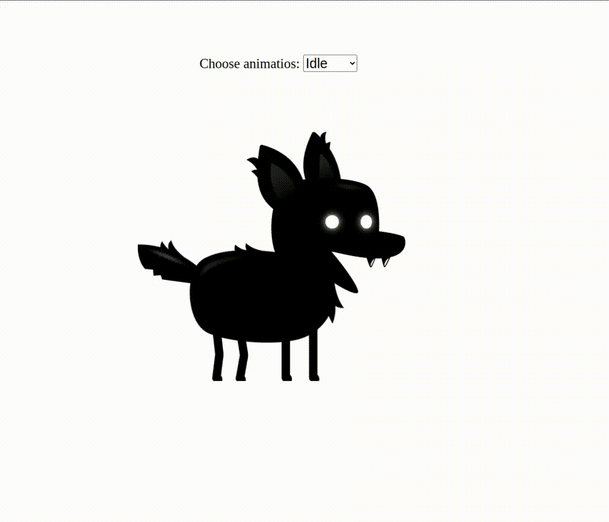

# Animación de Sprites con JavaScript

Este proyecto ejemplifica la implementación de animaciones de sprites en juegos con JavaScript, empleando técnicas avanzadas para lograr animaciones suaves y control total sobre las hojas de sprites. La animación de sprites es esencial para mejorar la calidad visual de los juegos y proporcionar un aspecto profesional.

## Características

- **Selección de Animaciones:** Utiliza un menú desplegable para seleccionar diferentes estados de animación del jugador.
- **Configuración de Animaciones:** Configura fácilmente diferentes animaciones para el jugador cambiando una variable.

## Demostración en GIF

## Instrucciones de Uso

1. Clona o descarga el repositorio.
2. Abre el archivo `index.html` en tu navegador para visualizar las animaciones.

## Notas Adicionales

- Para obtener más detalles sobre cada sección, consulta el video tutorial https://www.youtube.com/watch?v=CY0HE277IBM&t=1408s&ab_channel=Frankslaboratory

---
